# chap0x12 实战Bro网络入侵取证
## 实验环境
#### 安装bro
```txt
apt-get install bro bro-aux
```
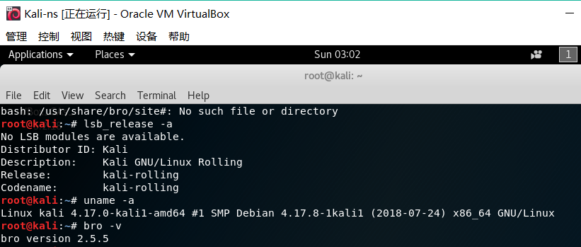

####  编辑bro的配置文件
编辑/etc/bro/site/local.bro文件，在文件末尾追加两行新配置
```txt
@load frameworks/files/extract-all-files # 提取所有文件
@load mytuning.bro
```

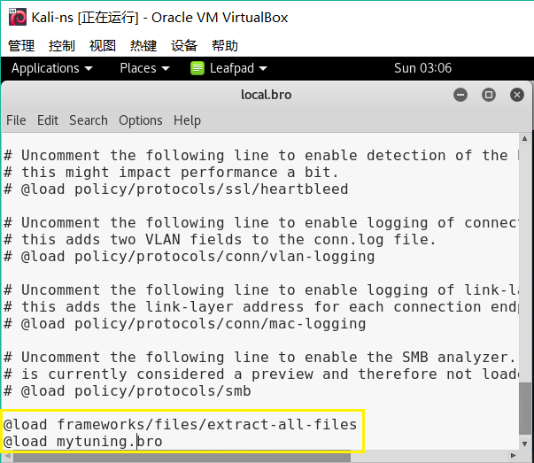

在在/etc/bro/site/目录下创建新文件mytuning.bro，内容如下：
```txt
redef ignore_checksums = T;
```

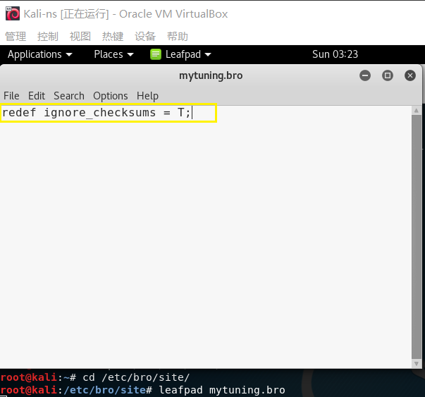

## 使用bro自动化分析pcap文件
#### 下载pcap包
```txt
wget  https://sec.cuc.edu.cn/huangwei/textbook/ns/chap0x12/attack-trace.pcap
```
#### 使用bro进行分析
```txt
bro -r attack-trace.pcap /etc/bro/site/local.bro
```
出现如下警告信息：
```txt
WARNING: No Site::local_nets have been defined. It's usually a good idea to define your local networks.
```
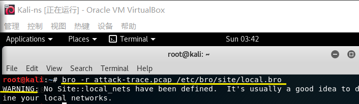

此警告不会对本次入侵取证实验产生影响，如需要消除上述警告信息，可对mytuning.bro文件进行编辑，增加如下内容：
```txt
redef Site::local_nets = {  192.150.11.0/24  };
```

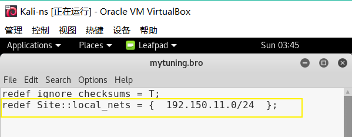

添加或不添加上述变量定义，仅会影响bro运行过程中是否会产生警告信息，增加这行关于本地网络IP地址范围的定义对于本次实验来说会新增2个日志文件，会报告在当前流量（数据包文件）中发现了本地网络IP和该IP关联的已知服务信息。

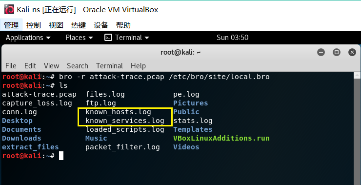

## 入侵取证
在attack-trace.pcap文件的当前目录下会生成一些.log文件和一个extract_files目录，在该目录下会发现有一个文件。
```txt
# file extract-1240198114.648099-FTP_DATA-FHUsSu3rWdP07eRE4l 
extract-1240198114.648099-FTP_DATA-FHUsSu3rWdP07eRE4l: PE32 executable (GUI) Intel 80386, for MS Windows
```

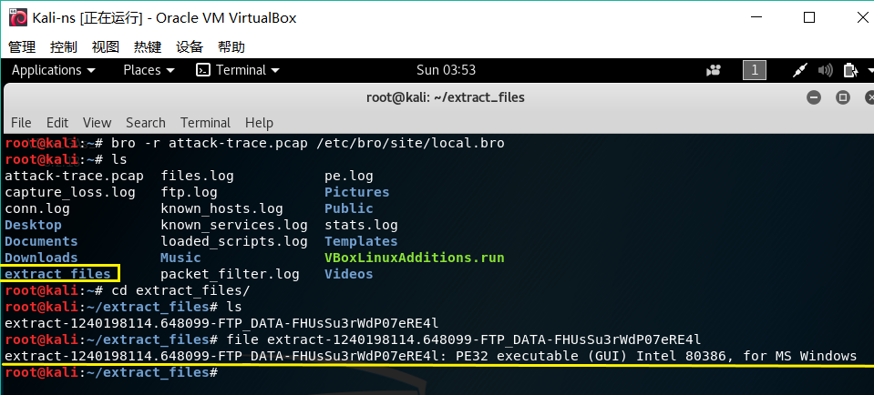

将该文件上传到 x.threatbook.cn，发现匹配了一个历史扫描报告，由报告的信息可知这是一个已知的后门程序，基于这个发现就可以进行逆向倒推，寻找入侵线索了。

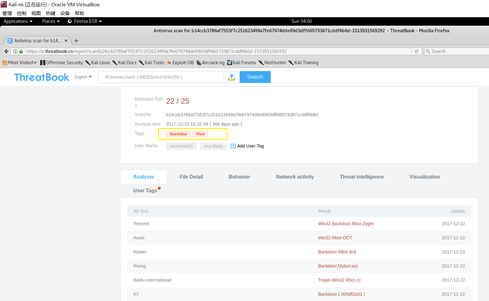

阅读/usr/share/bro/base/files/extract/main.bro 的源代码

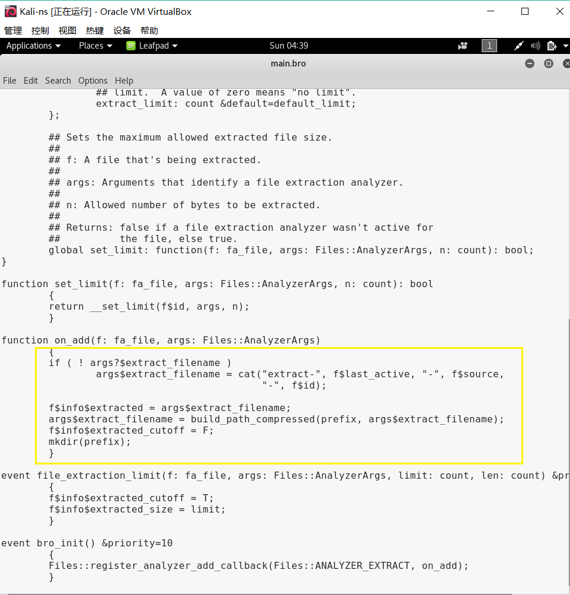

了解到该文件名的最右一个，即右侧对应的字符串```FHUsSu3rWdP07eRE4l```是files.log中的文件唯一标识。

通过查看files.log，发现该文件提取自网络会话标识（bro根据IP五元组计算出的一个会话唯一性散列值）```Cs7q5x3pTyu50QjPv```的FTP会话。

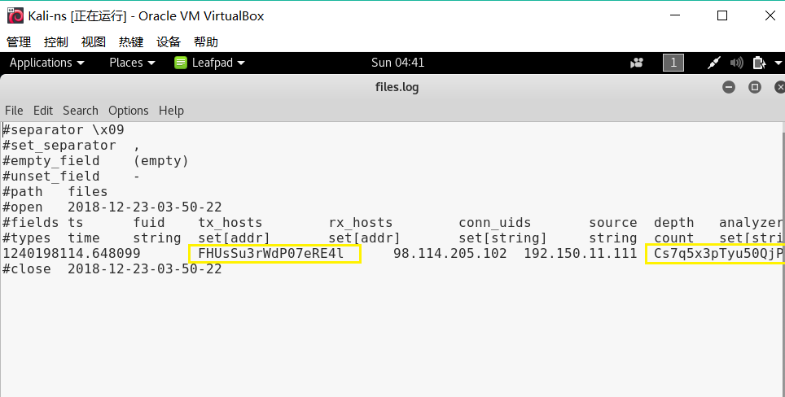

该```Cs7q5x3pTyu50QjPv```会话标识在conn.log中可以找到对应的IP五元组信息。

通过conn.log的会话标识匹配，我们发现该PE文件来自于IPv4地址为```98.114.205.102```的主机。

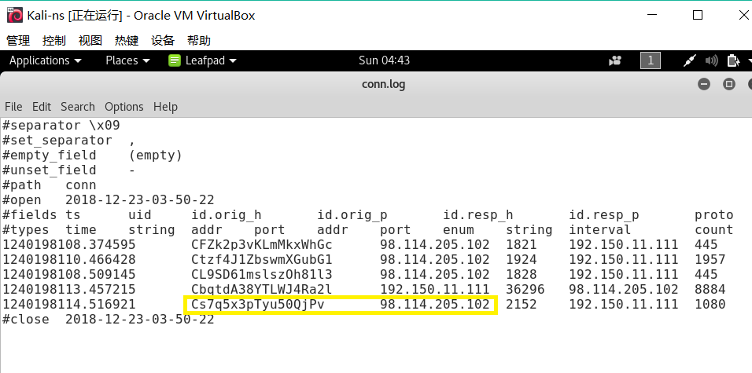

* 参考
  *  https://github.com/yangyisama/ns/tree/87e973e942aa5a3662f2b6e9de9b16a746f3c483/2017-2/icoy_U2Vino_yangyisama/Hw4-yangyisama
  *  https://sec.cuc.edu.cn/huangwei/textbook/ns/chap0x12/exp.html