# 移动互联网安全 
## 第二章 无线网络监听

### 802.11标准的数据包类型
1. **数据**: 数据数据包的作用是用来携带更高层次的数据(如IP数据包，ISO7层协议)。
它负责在工作站之间传输数据
2. **管理**: 管理数据包控制网络的管理功能
    1) 信标帧(Beacons): 在无线设备中，定时依次按指定间隔发送的有规律的无线信号(类似心跳包)，主要用于定位和同步使用
    2) 解除认证(Deauthentication)数据包 
    3) Probe(request and response)
    4) Authenticate(request and response)
    5) Associate(request and response)
    6) Reassociate(request and response)
    7) Dissassociate(notify) 
管理帧负责监督，主要用来加入或退出无线网络，以及处理接入点之间连接的转移事宜
3. **控制**: 控制数据包得名于术语"媒体接入控制(Media Access Control, MAC)"，是用来控制对共享媒体(即物理媒介，如光缆)的访问
    1) 请求发送(Request To Send，RTS)数据包
    2) 清除发送(Clear To Send，CTS)数据包
    3) ACK确认(RTS/CTS)  
    4) PS-Poll: 当一部移动工作站从省电模式中苏醒，便会发送一个 PS-Poll 帧给基站，以取得任何暂存帧 
控制帧通常与数据帧搭配使用，负责区域的清空、信道的取得以及载波监听的维护，并于收到数据时予以正面的应答，借此促进工作站间数据传输的可靠性

### Wi-Fi无加密交互过程
1. AP发送Beacon广播管理帧
2. 客户端向承载指定SSID的AP发送Probe Request(探测请求)帧
3. AP接入点对客户端的SSID连接请求进行应答
4. 客户端对目标AP请求进行身份认证(Authentication)
5. AP对客户端的身份认证(Authentication)请求作出回应
6. 客户端向AP发送连接(Association)请求
7. AP对连接(Association)请求进行回应
8. 客户端向AP请求断开连接(Disassociation)

### 实验过程&问题回答
#### 实验过程
1. 查看网络设备

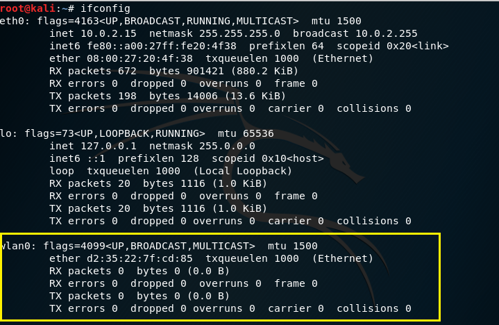

2. 无线网卡的工作模式是managed，且AP值为Not-Associated

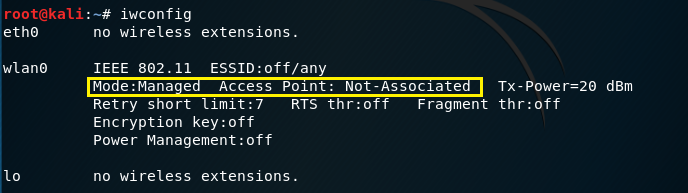

3. 查看附近无线网络的SSID，自动处理UTF-8编码的SSID名称

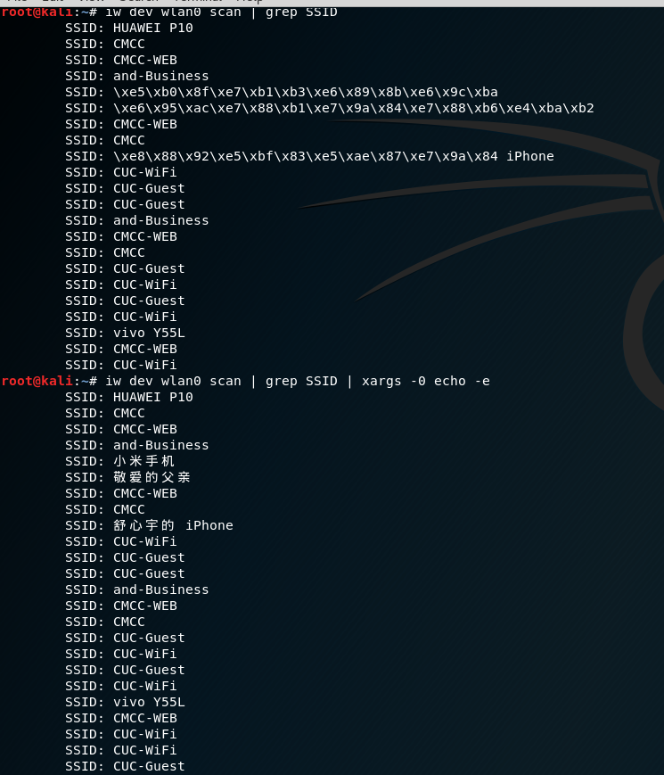

4. 开启网卡监听模式，查看网卡监听channel

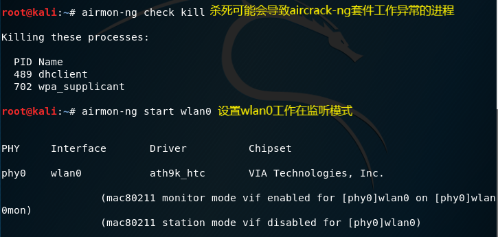

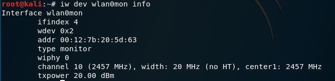

5. 进行抓包

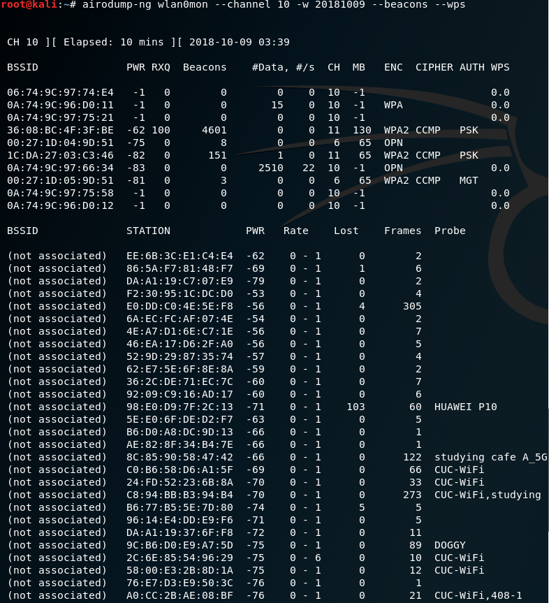

* 在wireshark中打开.cap文件

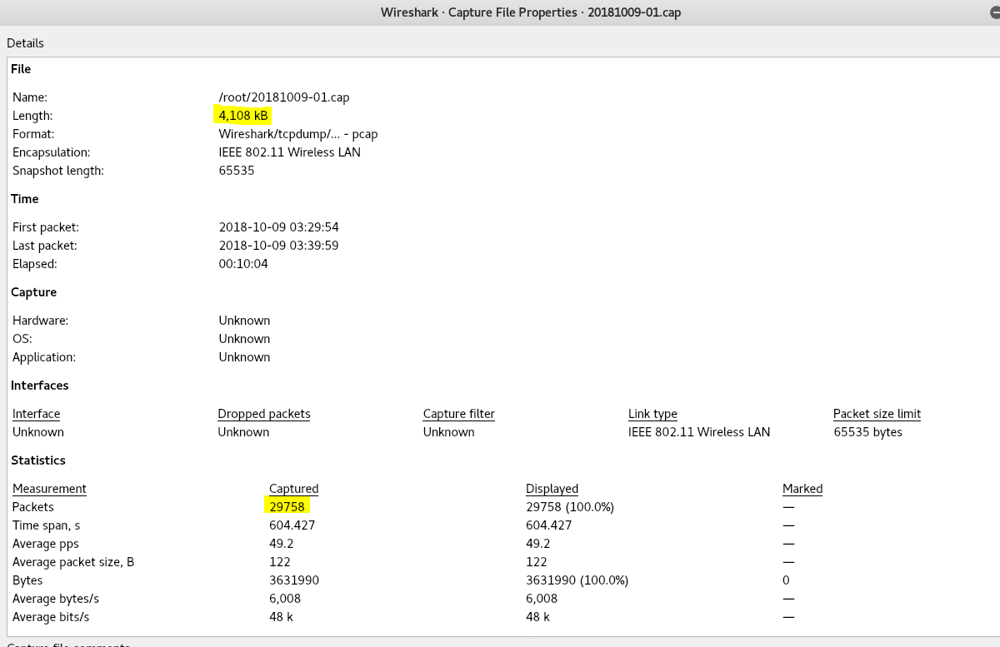

* 整理得到的数据

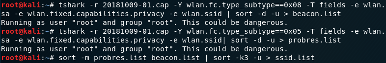

* 得到SSID的列表
* beacon.list
 
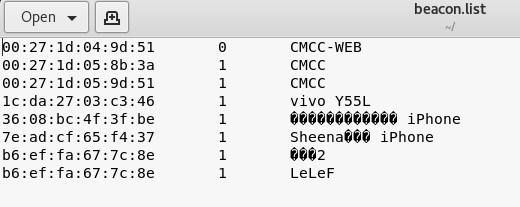  

* probres.list

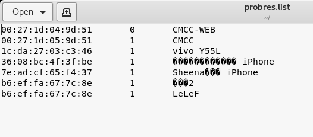  

* ssid.list
 
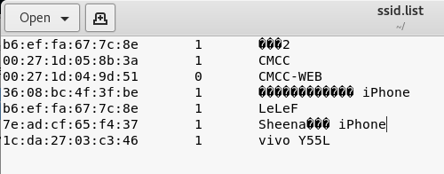  

#### 问题回答

##### 1.查看统计当前信号覆盖范围内一共有多少独立的SSID？其中是否包括隐藏SSID？
共有7个独立的SSID，SSID为空的是隐藏SSID，因此没有隐藏SSID
* 关于隐藏SSID
   * beacon帧的SSID字段为空  
   * 其他信息比如信道，频宽，支持的速率集，其他一些wifi特性，以及正常的控制帧和数据帧都不隐藏
   * 隐藏SSID 并不能避免WI-FI被抓包破解

##### 2.哪些无线热点是加密/非加密的？加密方式是否可知？
* 连接时需要输入密码的是加密的
* 连接时无需输入密码就是非加密的
* LeLeF是我手机的热点，SSID名称可以自己改，但是不能隐藏；开启时即可选择是否加密，且显示加密方式

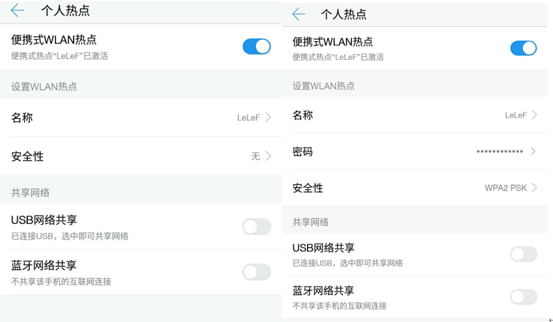

* 对于抓取到的包根据Beacon帧的wlan.fixed.capabilities.privacy判断，即整理后ssid.list的中间列
   * 1 为加密，如我手机的热点是加密
   * 0 为未加密，如CMCC-WEB未加密

* 加密方式根据认证帧的wlan.fixed.auth.alg判断
  * 1 SharedKey 
  * 0 OpenSystem 

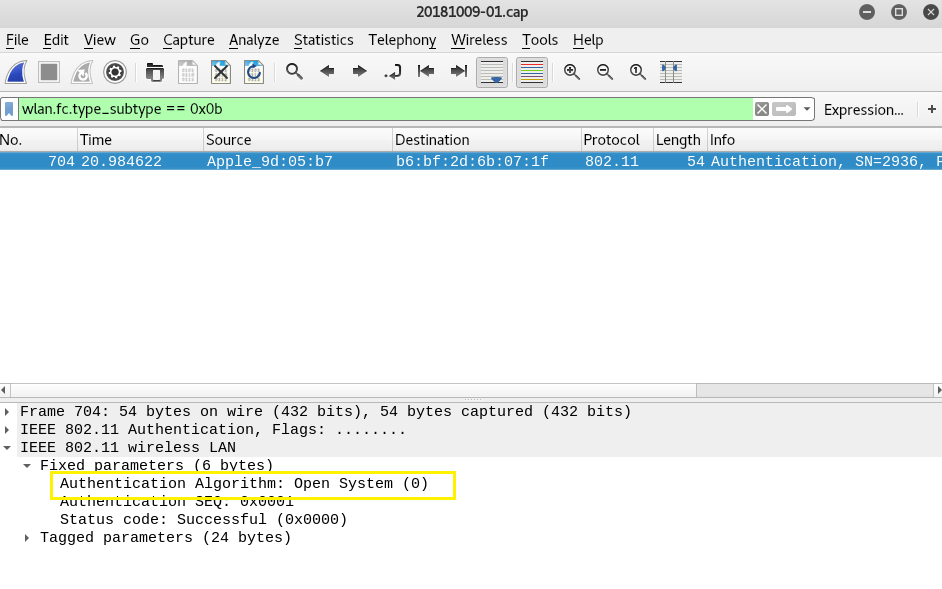

##### 3.如何分析出一个指定手机在抓包时间窗口内在手机端的无线网络列表可以看到哪些SSID？这台手机尝试连接了哪些SSID？最终加入了哪些SSID？
* 只要手机被覆盖在当前信号覆盖范围内，那么网卡所监听到的所有非隐藏SSID，都可以在手机端的无线网络中看到;因为隐藏的SSID只允许有过接入历史的设备连接，所以无法判定网卡捕捉到的隐藏SSID是否被手机端看到或接入。
* 根据Wi-Fi无加密交互过程可知
  *  手机搜寻无线热点时，会广播Probe Request帧，如果该手机在无线热点范围内，则会收到AP返回的Probe Response帧，则可以看到SSID列表
  *  根据手机MAC地址过滤Probe Request帧，就可以判断指定手机尝试连接哪些SSID，甚至有可能能知道该手机曾经连过哪些SSID
  

> 此处没有抓取到相应数据  

* 最终加入的SSID - Association Response帧，数据帧
  * 查找含有Association 
Response帧源地址的MAC地址的封包，可得知该手机是否成功加入了哪个SSID，且可以查看连接状态等信息
  * 根据数据帧可以直接得知该手机到底在使用哪个SSID 

##### 4.SSID包含在哪些类型的802.11帧？
实验：
* Beacon Frame 
* Probe Request 
* Probe Response 
查找：
* Association Request 
* Reassociation Request 

* 参考
  * http://www.cnblogs.com/littlehann/p/3700357.html
  * https://github.com/CUCCS/2018-NS-Public-jckling/pull/3
  * https://github.com/CUCCS/2018-NS-Public-Lyc-heng/blob/bfe483d4fd6a61c1518d99211d10ecddcb13da0f/mis_chap0x02/%E5%AE%9E%E9%AA%8C%E6%8A%A5%E5%91%8A.md