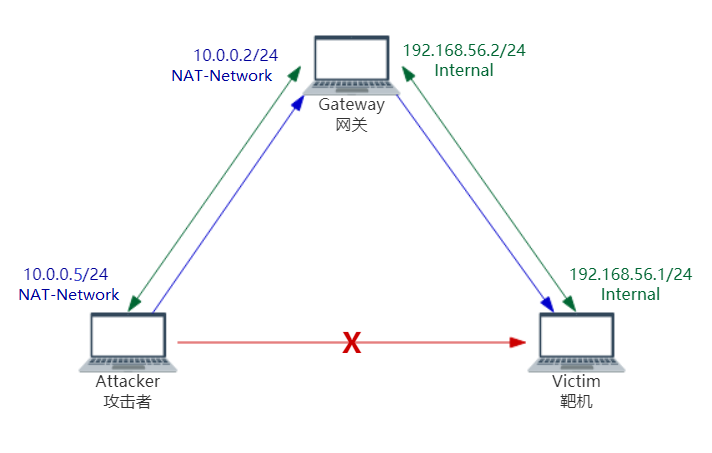

# chap0x01实验报告
## 一、实验要求
* [ ] chap0x01 基于VirtualBox的网络攻防基础环境搭建实例讲解
    * 节点：靶机、网关、攻击者主机
    * 连通性
        * 靶机可以直接访问攻击者主机
        * 攻击者主机无法直接访问靶机
        * 网关可以直接访问攻击者主机和靶机
        * 靶机的所有对外上下行流量必须经过网关
        * 所有节点均可以访问互联网
    * 其他要求
        * 所有节点制作成基础镜像（多重加载的虚拟硬盘）

## 二、实验过程
### 虚拟硬盘多重加载
* 完成虚拟机的安装（包含增强功能）
* 打开虚拟介质管理器，点击释放虚拟机，并将虚拟机类型改为多重加载
* 新建虚拟机时选择“使用已有的虚拟硬盘文件”，即可新建相同的虚拟机

### 网络及配置
#### 网络拓扑图
* 靶机和网关的内网端口在同一网段
* 攻击者和网关的NAT端口在同一网段

#### 网卡配置
**Gateway 网关**
* 两块网卡
  * eth0：NAT网络 IP: 10.0.0.2/24
  * eth1：Internal网络 IP: 192.168.56.2/24  默认网关为10.0.0.2
*  自行创建NAT网络

* 在Wired Setting中手动添加IPv4设置，两个网卡都可以连接

**Victim 靶机**
* 一块网卡 
  * Internal 模式 IP: 192.168.56.1/24  
  * 默认网关设置为192.168.56.2  和网关的Internal端口在同一网络

**Attacker 攻击者**
* 一块网卡
  * NAT网络 IP: 10.0.0.5/24
  * 和网关的NAT端口在同一网络

### 测试
**Gateway 网关**
* 可以ping通靶机
* 可以ping通攻击者
* 还不能联网

* 对/etc/resolv.conf 文件进行配置，可以联网

**Victim 靶机**
* 可以ping通网关
* 不能ping通攻击者
* 由于设置了默认网关，靶机的流量都经过网关，此时不能联网
* 对网关进行动态源地址转换的配置

* 由于网关默认不会转发包，所以靶机依然不能联网，对网关进行防火墙配置

* 靶机可以联网，并且可以ping通攻击者

* 进行监听，靶机的上下行流量都经过网关

**攻击者**
* 可以ping通网关
* 可以联网（已进行DNS配置）
* 不能ping通靶机

参考：
* 网络设置
  * https://askubuntu.com/questions/868942/how-to-configure-2-network-interfaces-with-different-gateways
  * https://blog.csdn.net/zsd747289639/article/details/53133695
* https://github.com/CUCCS/2018-NS-Public-jckling/pull/1