# 网络安全chap0x05 网络端口扫描

## 一、理论知识
### 1. TCP connect scan（ TCP连接扫描）
TCP连接是客户端和服务器之间的三次握手。如果发生三次握手，则建立通信。


一个试图连接到端口80上的服务器的客户机通过发送设置了SYN标志的TCP包和它想要连接的端口(在本例中是端口80)来初始化连接。如果该端口在服务器上是打开的，并且已经在接受连接的过程中，它将使用设置了SYN和ACK标志的TCP包进行响应。连接是由客户机在最后一次握手时发送确认ACK和RST标志来建立的。如果完成了三次握手，那么可以说明该服务器上的该端口就是打开的。


客户端使用SYN标志和端口发送第一次握手，以连接到TCP包中的服务器。如果服务器响应的是RST而不是synack，那么该特定端口将在服务器上关闭。


### 2. TCP stealth scan （TCP隐形扫描） 
此技术类似于TCP连接扫描。客户端发送一个TCP数据包，其中设置了SYN标志和要连接的端口号。如果端口打开，服务器将使用TCP数据包内的SYN和ACK标志进行响应。但是这次客户端在TCP数据包中发送RST标志而不是RST + ACK，这是TCP连接扫描中的情况可，用于避免防火墙检测端口扫描。

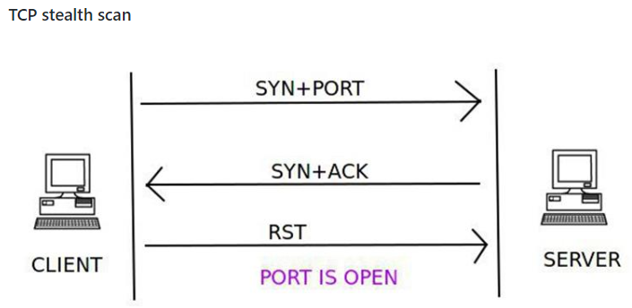

关闭端口检查与TCP连接扫描相同。服务器使用在TCP数据包内设置的RST标志进行响应，以指示服务器上的端口已关闭。

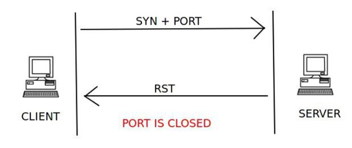

### 3. TCP XMAS scan （XMAS扫描）
在XMAS扫描中，将设置了PSH，FIN和URG标志的TCP数据包以及要连接的端口发送到服务器。如果端口已打开，则服务器将不会响应。

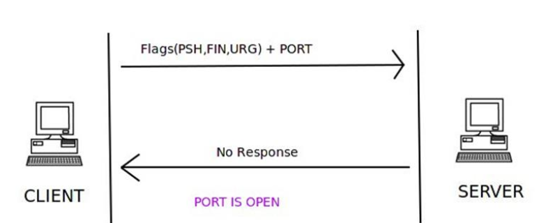

如果服务器响应TCP数据包内设置的RST标志，则服务器上的端口关闭。

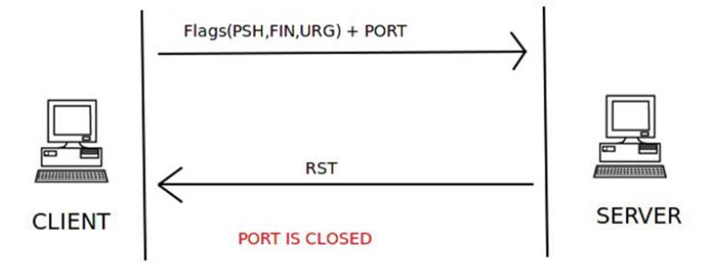

如果服务器使用ICMP数据包无法访问错误类型3和ICMP代码1,2,3,9,10或13进行响应，则端口将被过滤，无法从响应中推断出端口是打开还是关闭。

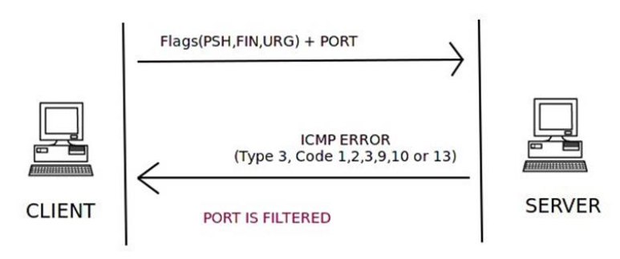

### 4. UDP scan （UDP扫描）
TCP是面向连接的协议，UDP是无连接协议。

面向连接的协议是一种协议，其中通信信道应该在客户端和服务器之间可用，然后才进行进一步的分组传输。如果客户端和服务器之间没有通信通道，则不再进行进一步的通信。

无连接协议是一种协议，其中进行数据包传输而不检查客户端和服务器之间是否存在可用的通信信道。假设目的地可用，数据仅发送到目的地。

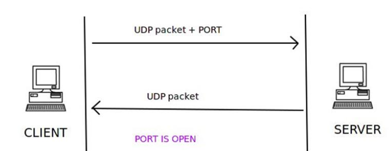

客户端发送一个UDP数据包，其中包含要连接的端口号。如果服务器使用UDP数据包响应客户端，则该特定端口在服务器上打开。

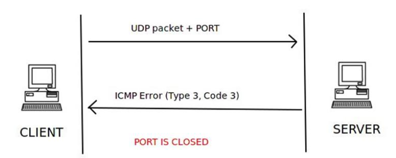

客户端发送UDP数据包和它想要连接的端口号，但服务器响应ICMP端口不可达错误类型3和代码3，这意味着端口在服务器上关闭。

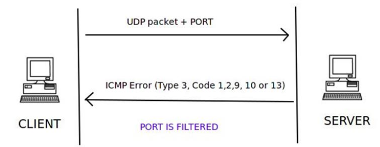

如果服务器使用ICMP错误类型3和代码1,2,9,10或13响应客户端，则会过滤服务器上的该端口。

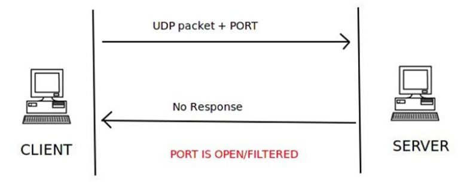

如果服务器没有对该端口的客户端UDP请求包发送响应，则可以得出这样的结论:服务器上的端口要么是打开的，要么是经过过滤的。端口的状态无法确定。

## 二、实验过程
### 网络设置
* 均使用intnet模式， Attacker与Victim在同一网络
  * Attacker 10.0.0.5
  * Victim 10.0.0.6
* 攻击者网络配置与连通性测试

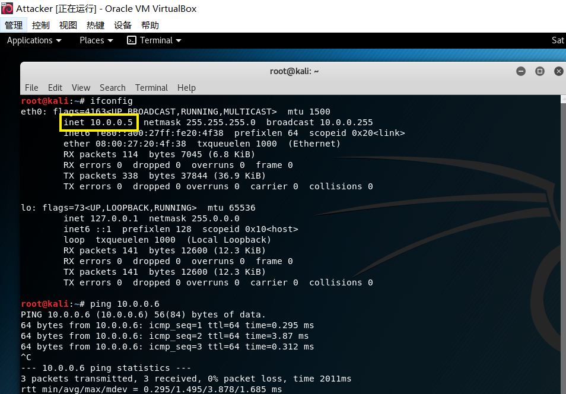

* 靶机网络配置

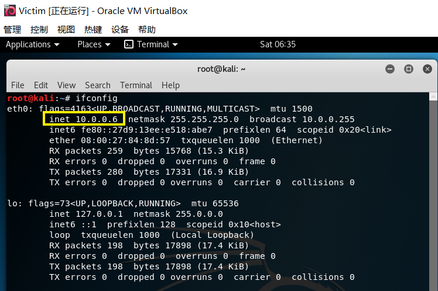

### 查看端口
TCP
* 查看靶机80端口的初始状态

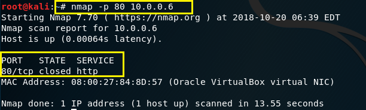

* 靶机打开80端口

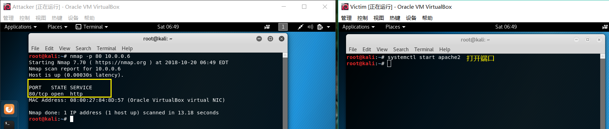

* 靶机80端口开启端口过滤

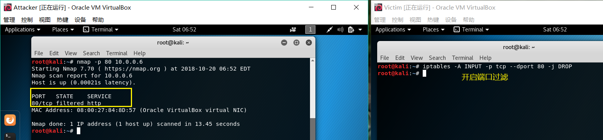

UDP
* 查看靶机53端口的初始状态

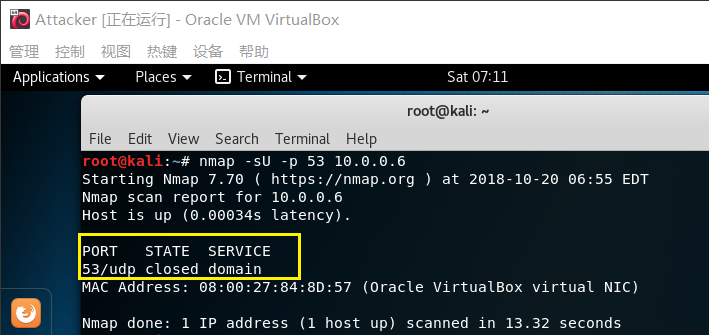

#### 对靶机的对应端口在open、closed、filtered的状态下进行网络端口扫描（使用不同扫描对应的python脚本），同时靶机抓包进行检验

###  TCP connect scan（ TCP连接扫描）
* tcp_connect_scan.py
```python
#! /usr/bin/python

import logging
logging.getLogger("scapy.runtime").setLevel(logging.ERROR)
from scapy.all import *

dst_ip = "10.0.0.6"
src_port = RandShort()
dst_port=80

tcp_connect_scan_resp = sr1(IP(dst=dst_ip)/TCP(sport=src_port,dport=dst_port,flags="S"),timeout=10)
if(str(type(tcp_connect_scan_resp))=="<type 'NoneType'>"):
    print "Closed"
elif(tcp_connect_scan_resp.haslayer(TCP)):
    if(tcp_connect_scan_resp.getlayer(TCP).flags == 0x12):
        send_rst = sr(IP(dst=dst_ip)/TCP(sport=src_port,dport=dst_port,flags="AR"),timeout=10)
        print "Open"
    elif (tcp_connect_scan_resp.getlayer(TCP).flags == 0x14):
        print "Closed"
```
* 80端口关闭

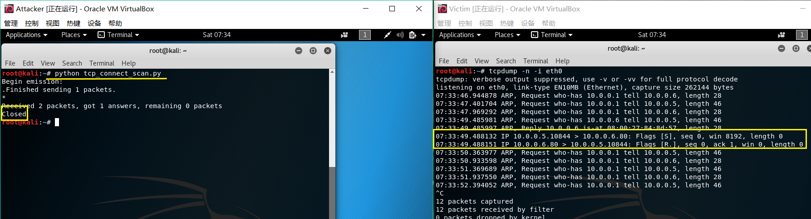

从靶机的抓包结果中看出，当80端口处于关闭状态的时候，攻击者向靶机发送了一个SYN包，靶机回复攻击者一个RST包。
* 80端口打开

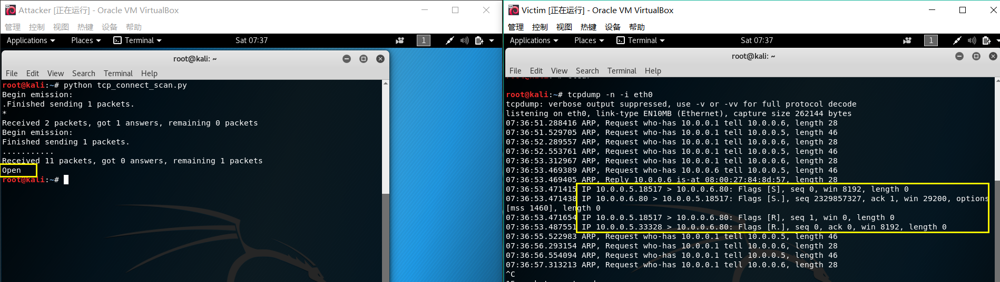

从靶机的抓包结果中看出，当80端口处于打开状态的时候，攻击者向靶机发送了一个SYN包，靶机回复攻击者一个RSYN包,然后攻击者又向靶机发送了一个RST包。
* 80端口开启过滤 

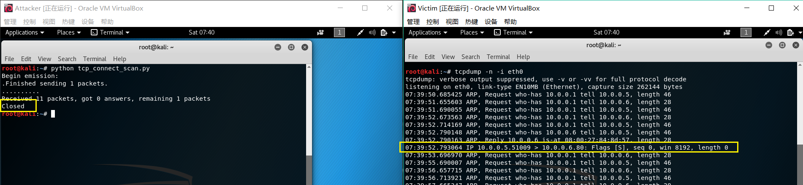
从靶机的抓包结果中看出，当80端口处于被过滤状态的时候，攻击者向靶机发送了一个SYN包，靶机没有回复。

### TCP stealth scan （TCP隐形扫描）
* tcp_stealth_scan.py
```python
#! /usr/bin/python

import logging
logging.getLogger("scapy.runtime").setLevel(logging.ERROR)
from scapy.all import *

dst_ip = "10.0.0.6"
src_port = RandShort()
dst_port=80

stealth_scan_resp = sr1(IP(dst=dst_ip)/TCP(sport=src_port,dport=dst_port,flags="S"),timeout=10)
if(str(type(stealth_scan_resp))=="<type 'NoneType'>"):
    print "Filtered"
elif(stealth_scan_resp.haslayer(TCP)):
    if(stealth_scan_resp.getlayer(TCP).flags == 0x12):
        send_rst = sr(IP(dst=dst_ip)/TCP(sport=src_port,dport=dst_port,flags="R"),timeout=10)
        print "Open"
    elif (stealth_scan_resp.getlayer(TCP).flags == 0x14):
        print "Closed"
elif(stealth_scan_resp.haslayer(ICMP)):
    if(int(stealth_scan_resp.getlayer(ICMP).type)==3 and int(stealth_scan_resp.getlayer(ICMP).code) in [1,2,3,9,10,13]):
        print "Filtered"
```
* 80端口关闭

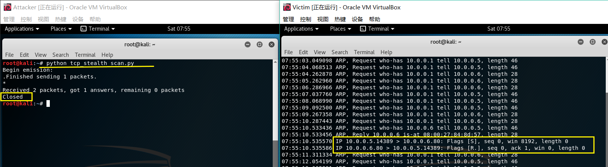

从靶机的抓包结果中看出，当80端口处于关闭状态的时候，攻击者向靶机发送了一个SYN包，靶机回复攻击者一个RST包。
* 80端口打开

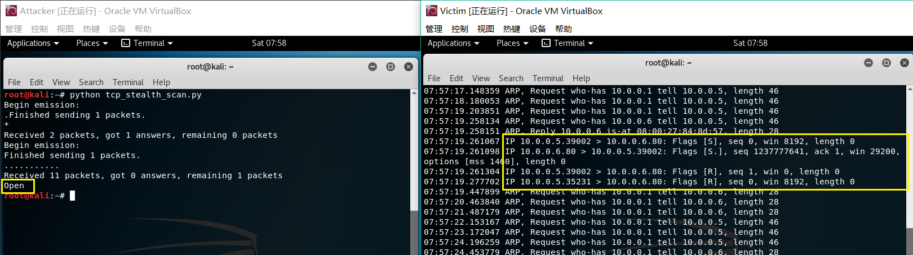

从靶机的抓包结果中看出，当80端口处于打开状态的时候，攻击者向靶机发送了一个SYN包，靶机回复攻击者一个RSYN包,然后攻击者又向靶机发送了一个RST包。
* 80端口开启过滤 

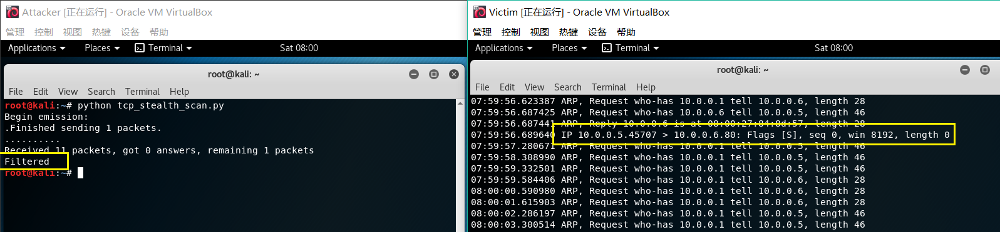
从靶机的抓包结果中看出，当80端口处于被过滤状态的时候，攻击者向靶机发送了一个SYN包，靶机没有回复。

###  TCP XMAS scan （XMAS扫描）
* tcp_xmas_scan.py
```python
#! /usr/bin/python

import logging
logging.getLogger("scapy.runtime").setLevel(logging.ERROR)
from scapy.all import *

dst_ip = "10.0.0.6"
src_port = RandShort()
dst_port=80

xmas_scan_resp = sr1(IP(dst=dst_ip)/TCP(dport=dst_port,flags="FPU"),timeout=10)
if (str(type(xmas_scan_resp))=="<type 'NoneType'>"):
    print "Open|Filtered"
elif(xmas_scan_resp.haslayer(TCP)):
    if(xmas_scan_resp.getlayer(TCP).flags == 0x14):
        print "Closed"
elif(xmas_scan_resp.haslayer(ICMP)):
    if(int(xmas_scan_resp.getlayer(ICMP).type)==3 and int(xmas_scan_resp.getlayer(ICMP).code) in [1,2,3,9,10,13]):
        print "Filtered"
```
* 80端口关闭

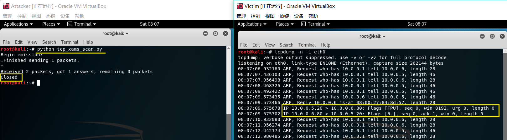

从靶机的抓包结果中看出，当80端口处于关闭状态的时候，攻击者向靶机发送了一个FPU包，靶机回复攻击者一个RST包。
* 80端口打开

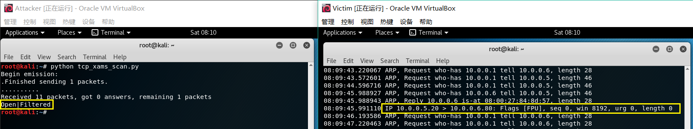

从靶机的抓包结果中看出，当80端口处于打开状态的时候，攻击者向靶机发送了一个FPU包，靶机没有回复攻击者。
* 80端口开启过滤 

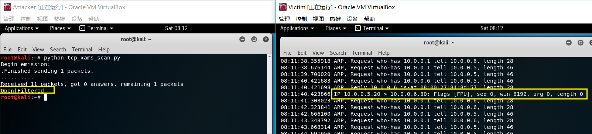
从靶机的抓包结果中看出，当80端口处于被过滤状态的时候，攻击者向靶机发送了一个FPU包，靶机没有回复。

### UDP scan （UDP扫描）
* udp_scan.py
```python
#! /usr/bin/python

import logging
logging.getLogger("scapy.runtime").setLevel(logging.ERROR)
from scapy.all import *

dst_ip = "10.0.0.6"
src_port = RandShort()
dst_port=53
dst_timeout=10

def udp_scan(dst_ip,dst_port,dst_timeout):
    udp_scan_resp = sr1(IP(dst=dst_ip)/UDP(dport=dst_port),timeout=dst_timeout)
    if (str(type(udp_scan_resp))=="<type 'NoneType'>"):
        retrans = []
        for count in range(0,3):
            retrans.append(sr1(IP(dst=dst_ip)/UDP(dport=dst_port),timeout=dst_timeout))
        for item in retrans:
            if (str(type(item))!="<type 'NoneType'>"):
                udp_scan(dst_ip,dst_port,dst_timeout)
        return "Open|Filtered"
    elif (udp_scan_resp.haslayer(UDP)):
        return "Open"
    elif(udp_scan_resp.haslayer(ICMP)):
        if(int(udp_scan_resp.getlayer(ICMP).type)==3 and int(udp_scan_resp.getlayer(ICMP).code)==3):
            return "Closed"
        elif(int(udp_scan_resp.getlayer(ICMP).type)==3 and int(udp_scan_resp.getlayer(ICMP).code) in [1,2,9,10,13]):
            return "Filtered"
print( dst_port,udp_scan(dst_ip,dst_port,dst_timeout))
```

* 53端口关闭

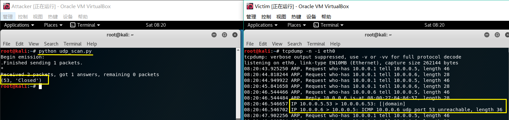

关闭状态时，靶机返回一个不可达的ICMP包，表示目标端口处于关闭状态。

* 53端口开启 


53端口其实已经打开了，但是扫描时还显示closed，情况和53端口关闭时一致。

* 53端口开启过滤


53端口可以开启过滤，但是查看端口状态时依然显示closed，扫描时可以看到过滤开启，靶机不返回信息给攻击者，无法判断端口是开启或是过滤。

## 参考资料
* https://resources.infosecinstitute.com/port-scanning-using-scapy/
* https://github.com/CUCCS/2018-NS-Public-yang5220/pull/3